<div align="center">

#  
# GuardianStock
###  Inventory Management System

<br />

**GuardianStock is a smart inventory management system designed to replace messy spreadsheets with a reliable, high-speed digital assistant. Built on (.NET 10), it ensures your data stays organized and accurate. The system monitors itself for errors in the background and sends instant, real-time alerts the moment your stock levels change, so you never miss an update.**
<br />
Built with **.NET 10** · **Clean Architecture** · **Domain-Driven Design** · **CQRS**

<br />

[](https://dotnet.microsoft.com/)
[](https://learn.microsoft.com/en-us/dotnet/csharp/)
[](https://www.microsoft.com/en-us/sql-server)
[](https://www.docker.com/)
[](LICENSE)

<br />

[Features](#-features) · [Architecture](#-architecture) · [Getting Started](#-getting-started) · [API Reference](#-api-reference) · [Docker](#-docker-deployment)

</div>

<br />

---

<br />

## 📑 Table of Contents

- [Overview](#-overview)
- [UI Screenshots](#-ui-screenshots)
- [Features](#-features)
  - [Core Business Capabilities](#core-business-capabilities)
  - [Technical Capabilities](#technical-capabilities)
- [Tech Stack](#-tech-stack)
- [Architecture](#-architecture)
  - [Database Diagram](#-database-diagram)
  - [High-Level Layer Overview](#high-level-layer-overview)
  - [Key Architectural Patterns](#key-architectural-patterns)
  - [CQRS Pipeline](#cqrs-pipeline)
  - [Domain Events Flow](#domain-events-flow)
  - [Project Architecture (C4 Diagrams)](#-project-architecture-c4-diagrams)
- [API Reference](#-api-reference)
  - [Authentication (v1)](#authentication-v1--apiv1auth)
  - [Users (v1)](#users-v1--apiv1users)
  - [Products (v2)](#products-v2--apiv2products)
  - [Categories (v2)](#categories-v2--apiv2categories)
  - [Inventories (v2)](#inventories-v2--apiv2inventories)
  - [Transactions (v2)](#transactions-v2--apiv2transactions)
  - [Alerts (v2)](#alerts-v2--apiv2alerts)
  - [Dashboard (v2)](#dashboard-v2--apiv2dashboard)
- [Role-Based Access Control](#-role-based-access-control)
- [Getting Started](#-getting-started)
  - [Prerequisites](#prerequisites)
  - [Installation](#1-clone--build)
  - [Configuration](#2-configure)
  - [Database Initialization](#3-database-initialization)
- [Docker Deployment](#-docker-deployment)
- [Configuration Reference](#%EF%B8%8F-configuration-reference)
- [Running Tests](#-running-tests)
- [Observability](#-observability)
  - [Structured Logging](#structured-logging)
- [Project Structure](#-project-structure)
- [Command & Query Inventory](#-command--query-inventory)
- [Contributing](#-contributing)
- [License](#-license)
- [Author](#-author)

<br />

---

<br />

## 🔎 Overview

**GuardianStock** is a comprehensive inventory management solution designed for businesses that need reliable product cataloging, real-time stock tracking, transaction recording, and automated low-stock alerting. The system provides a robust RESTful API with role-based access control, background job processing — all containerized and production-ready.

### Why GuardianStock?

| Challenge | Solution |
|---|---|
| Manual stock tracking is error-prone | Automated stock adjustments via transaction recording with full audit trail |
| Missed low-stock situations | Domain event-driven alerts with email notifications |
| Bulk data entry is tedious | CSV import with validation preview, confirmation workflow, and real-time progress |
| No visibility into operations | Dashboard analytics with sales charts, category breakdowns, and stock summaries |
| Complex deployment | Fully containerized with Docker Compose (API + SQL Server + Seq + SMTP) |

<br />

---

<br />

<br />

## 📸 UI Screenshots

Here are selected screenshots from the current frontend implementation:

<table>
<tr>
<td>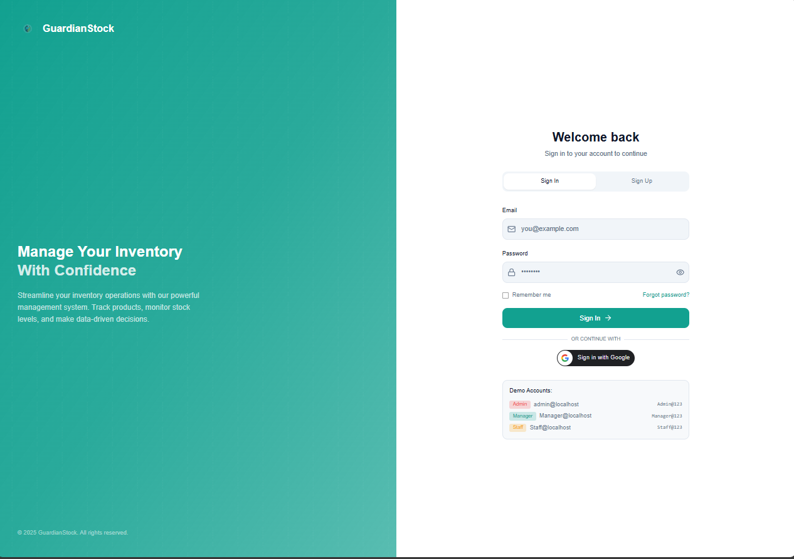</td>
<td>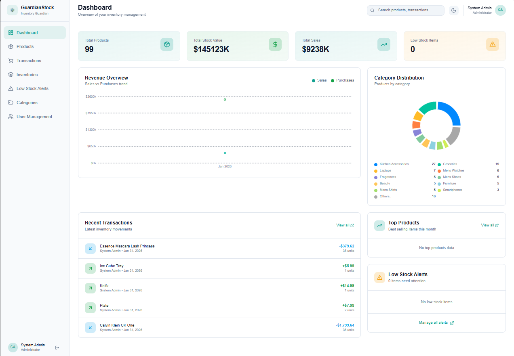</td>
</tr>
<tr>
<td>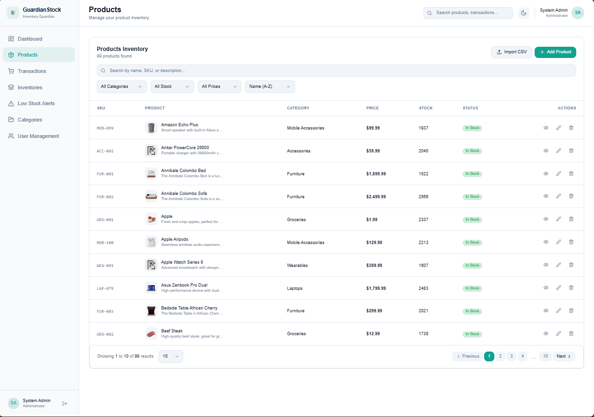</td>
<td>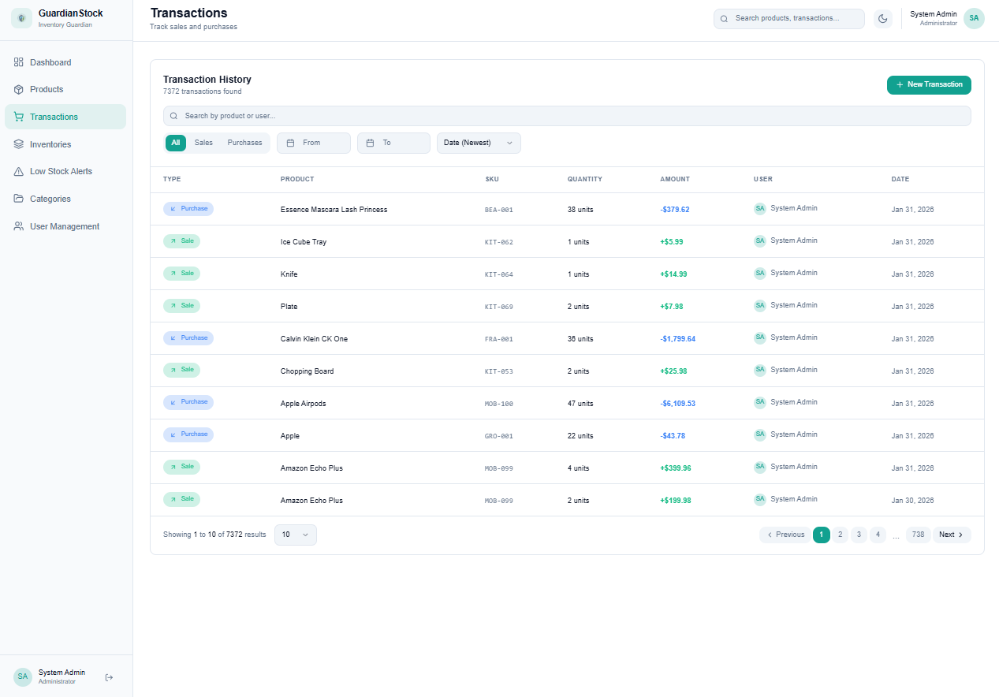</td>
</tr>
<tr>
<td>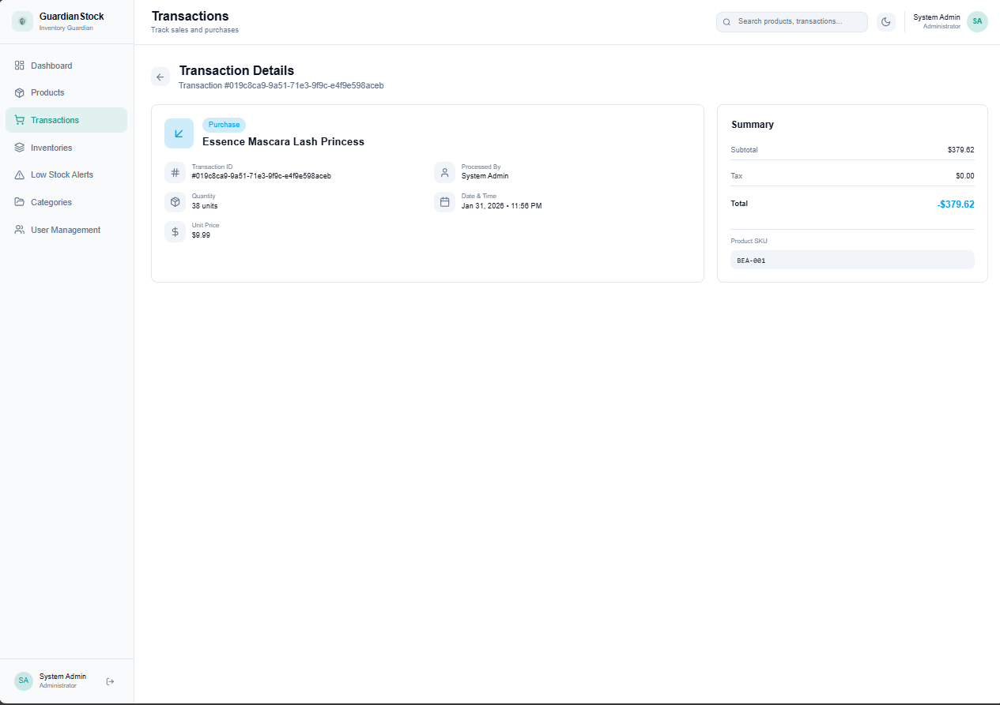</td>
<td>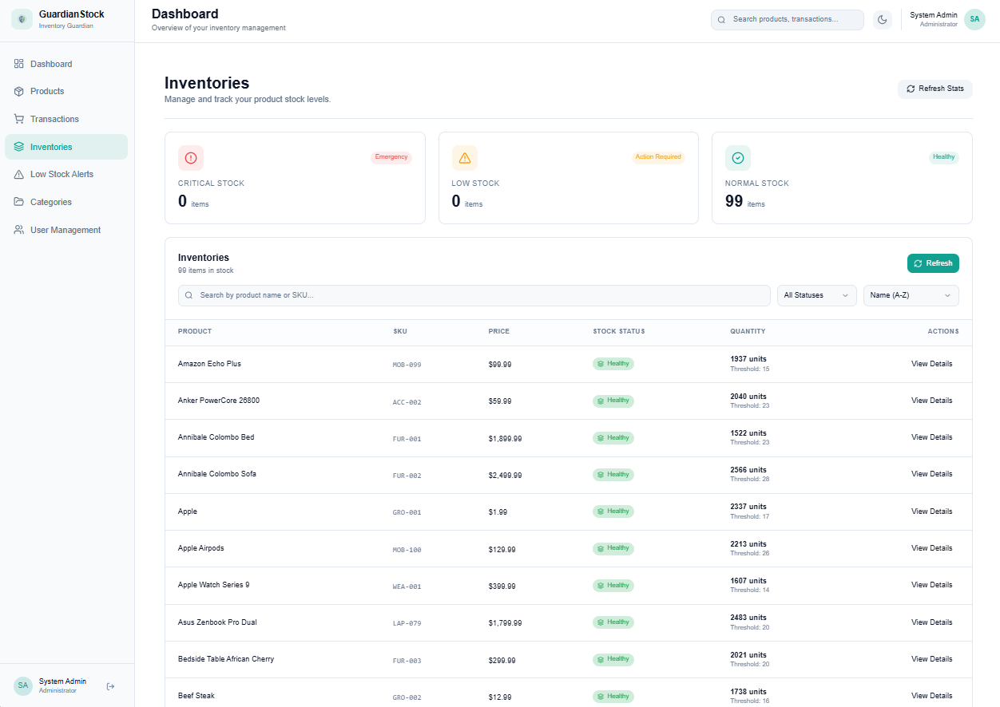</td>
</tr>
<tr>
<td>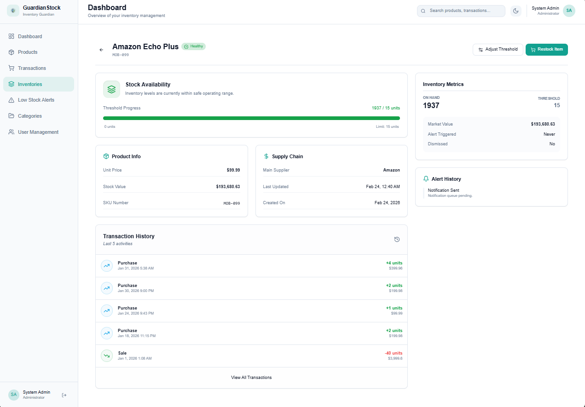</td>
<td>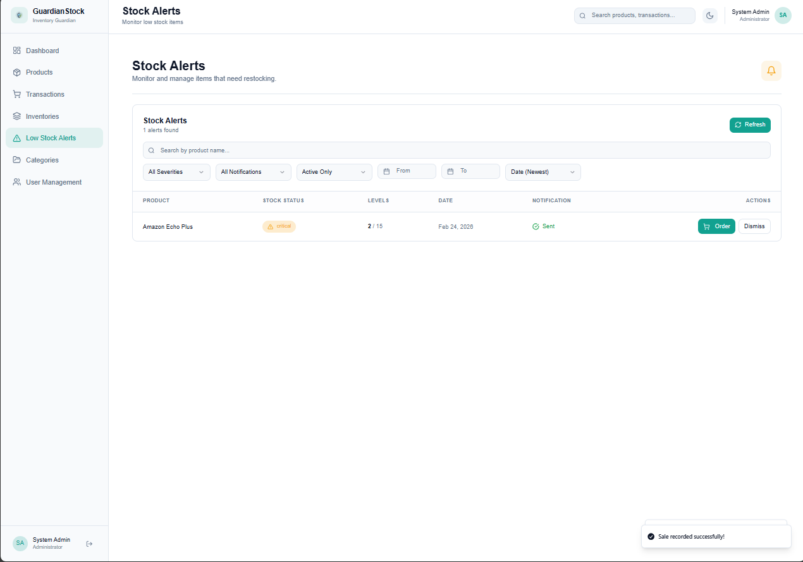</td>
</tr>
<tr>
<td>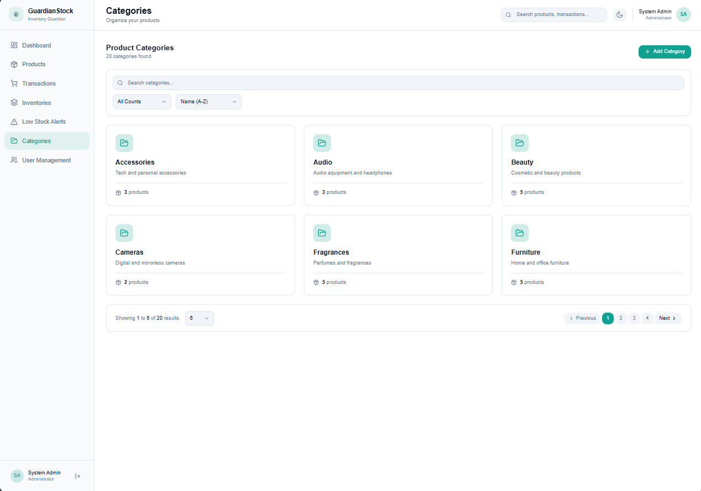</td>
<td>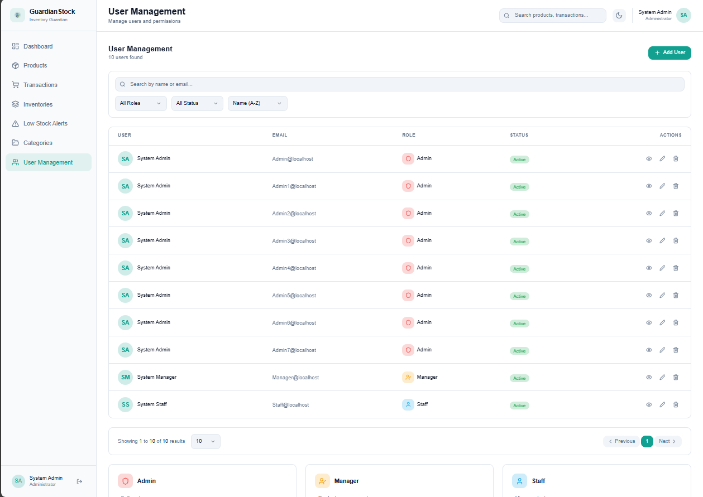</td>
</tr>
<tr>
<td colspan="2">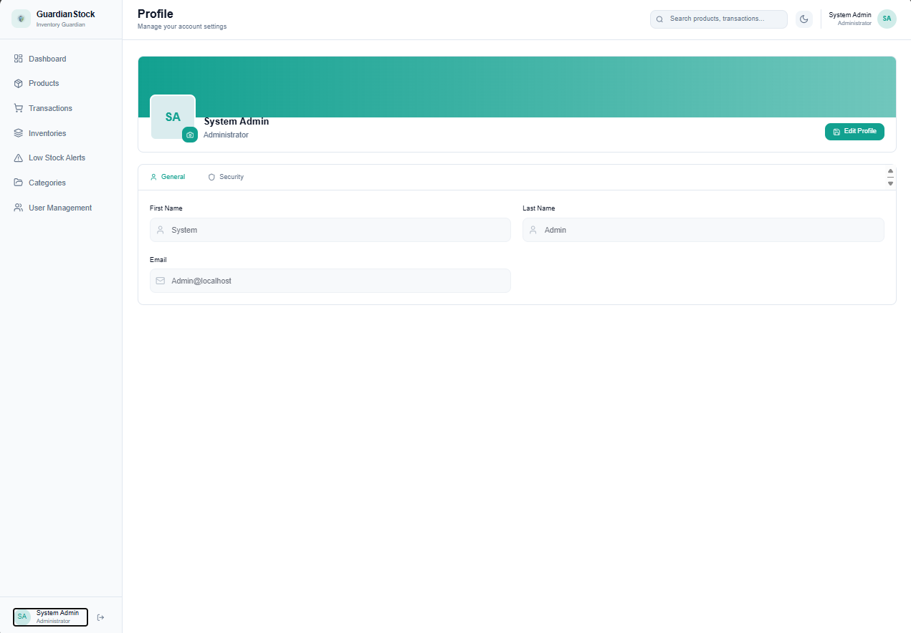</td>
</tr>
</table>

<br />

---


## 🚀 Features

### Core Business Capabilities

<table>
<tr>
<td width="50%">

#### 📦 Product Management
- Full CRUD with image uploads
- Auto-generated SKU identifiers
- Category-based classification
- Bulk CSV import with validation preview

</td>
<td width="50%">

#### 📊 Inventory Tracking
- Real-time stock level monitoring
- Configurable low-stock thresholds per product
- Three-tier health status: **Healthy** · **Low** · **Critical**
- Complete stock change history audit trail

</td>
</tr>
<tr>
<td width="50%">

#### 💳 Transaction Recording
- **Sale** transactions — automatically deduct stock
- **Purchase** transactions — automatically add stock
- Full transaction history with quantity, unit price, and total
- User attribution on every transaction

</td>
<td width="50%">

#### 🚨 Low-Stock Alerts
- Automated alert triggering via domain events
- Email notifications through background jobs
- Manual alert dismissal by managers
- Alert lifecycle tracking (triggered → notified → dismissed)

</td>
</tr>
<tr>
<td width="50%">

#### 📈 Dashboard Analytics
- Sales trends over time (line charts)
- Category distribution breakdowns
- Top-performing products ranking
- Recent transactions feed
- Stock health summary at a glance

</td>
<td width="50%">

#### 📁 Bulk CSV Import
- Upload CSV files for batch product creation
- Server-side validation with detailed error reporting
- Preview generation before confirmation
- Real-time import progress via SignalR
- Background processing via Hangfire

</td>
</tr>
</table>

### Technical Capabilities

<table>
<tr>
<td width="50%">

#### 🔐 Authentication & Authorization
- JWT access + refresh token authentication
- Google OAuth 2.0 social login
- Role-based access (Admin / Manager / Staff)
- Password recovery with OTP email verification

</td>
<td width="50%">

#### ⚡ Performance & Scalability
- Memory caching using HybridCache (only used L1 - cache)
- Background job processing with Hangfire
- Async real-time updates via SignalR
- API versioning (v1 / v2 side-by-side)

</td>
</tr>
<tr>
<td width="50%">

#### 🔭 Observability
- Structured logging with Serilog → Seq

</td>
<td width="50%">

#### 🐳 Deployment
- Multi-stage Docker build
- Docker Compose orchestration
- SQL Server container with volume persistence
- Seq & SMTP dev containers included

</td>
</tr>
</table>

<br />

---

<br />

## 🧰 Tech Stack

| Concern | Technology | Purpose |
|---|---|---|
| **Runtime** | .NET 10, C# 14 | Core platform and language |
| **API Framework** | ASP.NET Core | HTTP pipeline, routing, middleware |
| **Architecture** | Clean Architecture, DDD, CQRS | Structural organization and separation of concerns |
| **Mediator** | MediatR | Command/query dispatching and pipeline behaviors |
| **Validation** | FluentValidation | Request validation with rich error messages |
| **ORM** | Entity Framework Core | Data access and migrations |
| **Database** | SQL Server 2022 | Primary data store |
| **Identity** | ASP.NET Core Identity | User management and password hashing |
| **Auth Tokens** | JWT Bearer + Refresh Tokens | Stateless authentication |
| **Social Auth** | Google OAuth 2.0 | Third-party login |
| **Background Jobs** | Hangfire | Async processing (CSV imports, emails) |
| **Real-Time** | ASP.NET Core SignalR | WebSocket-based live progress updates |
| **Caching** | Microsoft HybridCache | Two-tier caching (L1 memory + L2 distributed) (Only Used L1)|
| **Email** | FluentEmail + Razor | Templated email delivery via SMTP |
| **CSV Parsing** | CsvHelper | Robust CSV file reading and mapping |
| **Logging** | Serilog | Structured logging to console, Seq |
| **API Docs** | Swagger / OpenAPI | Interactive API documentation |
| **API Versioning** | Asp.Versioning | Side-by-side versioned endpoints |
| **Testing** | xUnit, FluentAssertions | Domain unit testing with builder pattern |
| **Code Coverage** | Coverlet | Test coverage collection |
| **Containerization** | Docker, Docker Compose | Multi-container deployment |
| **Package Management** | Central Package Management | Centralized NuGet version control |

<br />

---

<br />

## 🏗 Architecture

The solution follows **Clean Architecture** with strict dependency rules — inner layers **never** reference outer layers. Each layer has a clearly defined responsibility.

### High-Level Layer Overview


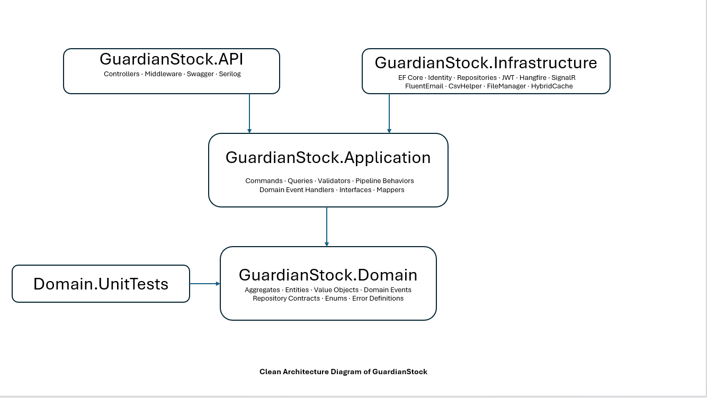
<br/>
```
               ▲ Dependencies flow inward (Domain = core)
```

### Key Architectural Patterns

| Pattern | Implementation |
|---|---|
| **CQRS** | Separate command and query handlers dispatched via MediatR |
| **Domain Events** | `TransactionCreatedDomainEvent`, `LowStockAlertTriggeredDomainEvent`, `InventoryCreatedDomainEvent` — dispatched through MediatR after persistence |
| **Result Pattern** | `Result<T>` monad for explicit, exception-free error handling |
| **Unit of Work** | Dual `SaveChangesAsync` — first save persists changes, domain events dispatch, second save persists side effects |
| **Pipeline Behaviors** | `LoggingBehavior` → `ValidationBehavior` → `UowTransactionBehavior` |
| **Repository Pattern** | Interfaces in Domain, implementations in Infrastructure |
| **Value Objects** | `LowStockAlert` as an EF Core owned entity on `Inventory` |
| **Aggregate Roots** | `Product`, `Category`, `Inventory`, `Transaction`, `User` — each encapsulating invariants |
| **Central Package Management** | `Directory.Packages.props` for solution-wide NuGet version control |

### CQRS Pipeline

Every HTTP request passes through MediatR's pipeline before reaching its handler:

```
HTTP Request → Controller → MediatR Pipeline
                              │
                              ├── 1. LoggingBehavior     (log request/response)
                              ├── 2. ValidationBehavior  (FluentValidation rules)
                              └── 3. UowTransactionBehavior (DB transaction scope)
                                        │
                                        ▼
                                  Command / Query Handler
                                        │
                                        ▼
                                  HTTP Response
```

### Domain Events Flow

Domain events follow a **"save → dispatch → save-again"** pattern to ensure both the command changes and event-driven side effects are persisted within the same transaction:

```
Command Handler                    UnitOfWork                     Event Handler
      │                                │                                │
      ├── Execute business logic       │                                │
      ├── Aggregate raises DomainEvent │                                │
      └── Call Complete() ──────────── ▶                                │
                                       ├── SaveChangesAsync [1st]       │
                                       │   (persists command changes)   │
                                       │                                │
                                       ├── Dispatch DomainEvents ─────► │
                                       │                                ├── Handle side effects
                                       │                                │   (StockHistory, Alerts)
                                       │◄───────────────────────────────┘
                                       │                                
                                       └── SaveChangesAsync [2nd]       
                                           (persists event side effects)
```

**Registered Domain Events:**

| Domain Event | Handler | Side Effect |
|---|---|---|
| `TransactionCreatedDomainEvent` | `TransactionCreatedDomainEventHandler` | Creates `StockHistory` record; adjusts `Inventory` quantity |
| `InventoryCreatedDomainEvent` | `InventoryCreatedDomainEventHandler` | Initializes inventory tracking |
| `LowStockAlertTriggeredDomainEvent` | `LowStockAlertTriggeredDomainEventHandler` | Schedules `SendLowStockEmailCommand` via Hangfire |

### 🗺 Project Architecture (C4 Diagrams)

> 📌 **C4 architecture diagrams below**
> - **Level 1** — System Context Diagram
>  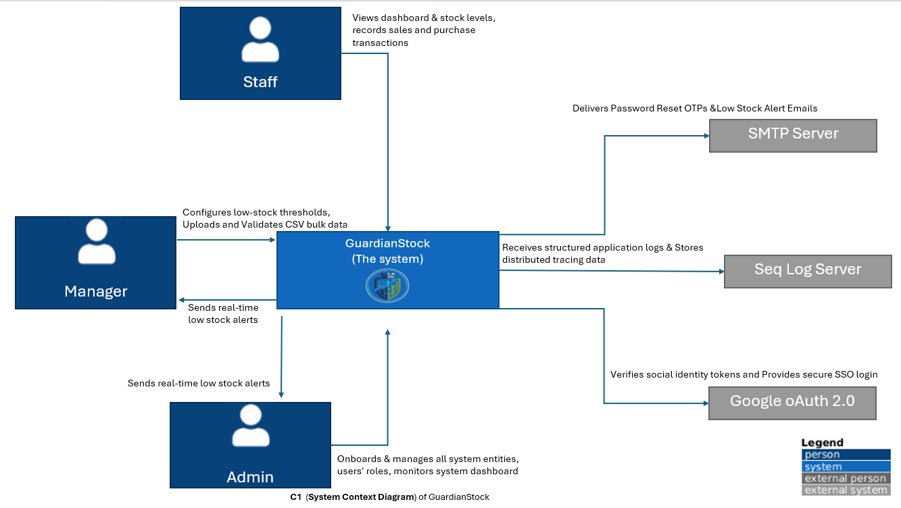

> - **Level 2** — High-Level Layer Overview
>  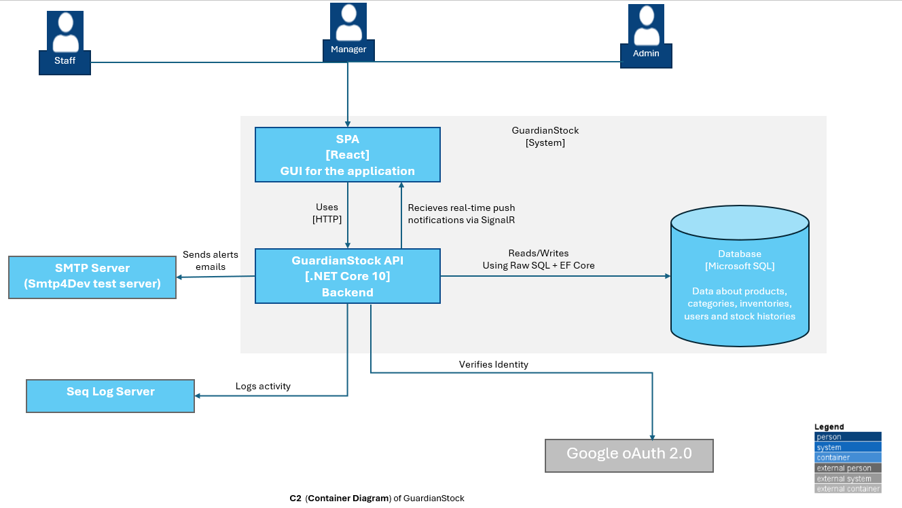
> - **Level 3** — Domain Model, CQRS Pipeline, Domain Events Flow
>  (**added later**)
> - **Level 4** — Infrastructure Components, API Request Lifecycle, Observability Stack
>  (**added later**)

<!-- 
TODO: Add rendered C4 diagram images here

 
-->

<br />

---

<br />

## 📊 Database Diagram

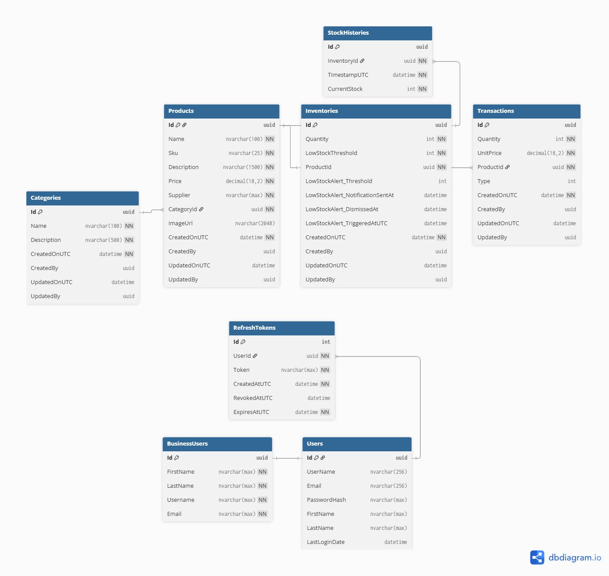


<br />

---

<br />

## 📡 API Reference

> Base URL: `api/v{version}` — The API supports **versioned endpoints** (v1 and v2) side-by-side.
>
> All protected endpoints require a valid JWT Bearer token in the `Authorization` header.
>
> **Swagger UI:** Interactive docs available at `https://localhost:{port}/swagger`

### Standard Response Envelope

Every API response is wrapped in a consistent `ApiResponse<T>` envelope:

```json
{
  "isSuccess": true,
  "message": "Operation completed successfully",
  "errorCode": null,
  "validationErrors": {},
  "meta": { "page": "1", "pageSize": "10" },
  "instance": "/api/v2/products",
  "traceId": "00-abc123...-01",
  "data": { }
}
```

| Field | Type | Description |
|---|---|---|
| `isSuccess` | `boolean` | Whether the operation was successful |
| `message` | `string` | Human-readable result message |
| `errorCode` | `string?` | Machine-readable error code (e.g., `INVALID_CREDENTIALS`) |
| `validationErrors` | `object?` | Field-level validation errors (`{ "email": "Required" }`) |
| `meta` | `object?` | Pagination metadata |
| `instance` | `string` | Request path |
| `traceId` | `string` | Distributed trace identifier for debugging |
| `data` | `T?` | The response payload (omitted on `204`) |

---

### Authentication (v1) — `api/v1/auth`

| Method | Route | Description | Auth |
|:---:|---|---|:---:|
| `POST` | `/register` | Register a new user account | 🌍 Public |
| `POST` | `/login` | Authenticate with email & password | 🌍 Public |
| `POST` | `/google-login` | Authenticate with Google ID token | 🌍 Public |
| `POST` | `/refresh-token` | Obtain new JWT using refresh token | 🌍 Public |
| `POST` | `/forget-password` | Send password reset OTP to email | 🌍 Public |
| `POST` | `/verify-reset-password-otp` | Verify OTP and receive reset token | 🌍 Public |
| `POST` | `/reset-password` | Reset password using reset token | 🌍 Public |
| `POST` | `/change-password` | Change current user's password | 🔒 All Roles |
| `POST` | `/logout` | Invalidate refresh token | 🔒 All Roles |
| `PUT` | `/update-profile` | Update current user's profile | 🔒 All Roles |

<details>
<summary><b>📋 Endpoint Details — Authentication</b></summary>

<br/>

#### `POST` /api/v1/auth/register — Register user

> Creates a new user account with the provided details.

**Request Body:**
```json
{
  "email": "user@example.com",
  "firstName": "John",
  "lastName": "Doe",
  "password": "P@ssw0rd123"
}
```

| Field | Type | Required | Description |
|---|---|:---:|---|
| `email` | `string` | ✅ | User's email address |
| `firstName` | `string` | ✅ | User's first name |
| `lastName` | `string` | ✅ | User's last name |
| `password` | `string` | ✅ | Password (min 8 characters) |

**Responses:**

| Status | Description |
|:---:|---|
| `200` | Registration successful |
| `400` | Validation errors (weak password, duplicate email, etc.) |

---

#### `POST` /api/v1/auth/login — Login user

> Authenticates a user with email and password, returning a JWT token for access.

**Request Body:**
```json
{
  "email": "user@example.com",
  "password": "P@ssw0rd123"
}
```

**200 — Success Response:**
```json
{
  "isSuccess": true,
  "data": {
    "user": {
      "id": "abc-123",
      "email": "user@example.com",
      "firstName": "John",
      "lastName": "Doe",
      "role": "Manager"
    },
    "accessToken": {
      "token": "eyJhbGciOiJI..."
    },
    "refreshToken": {
      "token": "d4f5a6b7..."
    }
  }
}
```

| Status | Description |
|:---:|---|
| `200` | Authentication successful — returns JWT + refresh token |
| `401` | Invalid credentials |

---

#### `POST` /api/v1/auth/google-login — Google login

> Authenticates a user using a Google ID token. Creates a new account if the user does not exist.

**Request Body:**
```json
{
  "idToken": "eyJhbGciOiJSU..."
}
```

| Status | Description |
|:---:|---|
| `200` | Returns JWT + refresh token (same schema as `/login`) |
| `400` | Invalid or expired Google token |

---

#### `POST` /api/v1/auth/refresh-token — Refresh token

> Obtains a new JWT token using a valid refresh token.

**Request Body:**
```json
{
  "refreshToken": "d4f5a6b7..."
}
```

| Status | Description |
|:---:|---|
| `200` | Returns new JWT + refresh token pair |
| `400` | Invalid or expired refresh token |

---

#### `POST` /api/v1/auth/forget-password — Forget password

> Generates a one-time password and sends it to the user's email for password reset.

**Request Body:**
```json
{
  "emailAddress": "user@example.com"
}
```

| Status | Description |
|:---:|---|
| `200` | OTP sent to email |

---

#### `POST` /api/v1/auth/verify-reset-password-otp — Verify OTP

> Validates the OTP sent to the user's email and returns a token for password reset.

**Request Body:**
```json
{
  "emailAddress": "user@example.com",
  "otp": "123456"
}
```

**200 — Success Response:**
```json
{
  "isSuccess": true,
  "data": {
    "resetPasswordToken": "eyJ0eXAiOiJK..."
  }
}
```

| Status | Description |
|:---:|---|
| `200` | Returns `resetPasswordToken` for the next step |
| `400` | Invalid or expired OTP |

---

#### `POST` /api/v1/auth/reset-password — Reset password

> Resets the user's password using the reset password token obtained from OTP verification.

**Request Body:**
```json
{
  "emailAddress": "user@example.com",
  "resetPasswordToken": "eyJ0eXAiOiJK...",
  "newPassword": "NewP@ssw0rd456"
}
```

| Status | Description |
|:---:|---|
| `200` | Password reset successfully |
| `400` | Invalid token or weak password |

---

#### `POST` /api/v1/auth/change-password — Change password 🔒

> Updates the password for the currently logged-in user.

**Request Body:**
```json
{
  "currentPassword": "OldP@ssw0rd",
  "newPassword": "NewP@ssw0rd456",
  "confirmNewPassword": "NewP@ssw0rd456"
}
```

| Status | Description |
|:---:|---|
| `200` | Password changed successfully |
| `400` | Current password incorrect or validation errors |
| `401` | Not authenticated |

---

#### `POST` /api/v1/auth/logout — Logout 🔒

> Invalidates the user's refresh token, effectively logging them out.

**Request Body:** _Empty body_ — the user is identified via the JWT token.

| Status | Description |
|:---:|---|
| `200` | Logged out successfully |
| `401` | Not authenticated |

---

#### `PUT` /api/v1/auth/update-profile — Update profile 🔒

> Updates the first name and last name for the currently logged-in user.

**Request Body:**
```json
{
  "firstName": "Jane",
  "lastName": "Smith"
}
```

**200 — Success Response:**
```json
{
  "isSuccess": true,
  "data": {
    "id": "abc-123",
    "email": "user@example.com",
    "firstName": "Jane",
    "lastName": "Smith",
    "role": "Manager"
  }
}
```

| Status | Description |
|:---:|---|
| `200` | Profile updated — returns updated user details |
| `400` | Validation errors |
| `401` | Not authenticated |

</details>

---

### Users (v1) — `api/v1/users`

| Method | Route | Description | Auth |
|:---:|---|---|:---:|
| `GET` | `/` | List all users (paginated) | 🔴 Admin |
| `GET` | `/{userId}` | Get user details by ID | 🔴 Admin |
| `POST` | `/` | Create a new user account | 🔴 Admin |
| `PUT` | `/{userId}` | Update user profile | 🔴 Admin |
| `POST` | `/{userId}/activate` | Re-activate a deactivated user | 🔴 Admin |
| `POST` | `/{userId}/deactivate` | Deactivate a user account | 🔴 Admin |

<details>
<summary><b>📋 Endpoint Details — Users</b></summary>

<br/>

#### `GET` /api/v1/users — List all users 🔴

> Fetches a paginated list of users. Requires Admin privileges.

**Query Parameters:**

| Parameter | Type | Default | Description |
|---|---|---|---|
| `page` | `int` | `1` | Page number |
| `pageSize` | `int` | `10` | Items per page |

| Status | Description |
|:---:|---|
| `200` | Paginated list of users |
| `401` | Not authenticated |
| `403` | Not an Admin |

---

#### `GET` /api/v1/users/{userId} — Get user by ID 🔴

> Retrieves full details for a single user using their unique identifier.

| Status | Description |
|:---:|---|
| `200` | User details |
| `401` | Not authenticated |
| `403` | Not an Admin |
| `404` | User not found |

---

#### `POST` /api/v1/users — Create user 🔴

> Creates a new user account with the specified role. The user receives an auto-generated password via email.

**Request Body:**
```json
{
  "firstName": "Alice",
  "lastName": "Johnson",
  "email": "alice@company.com",
  "role": "Manager"
}
```

| Field | Type | Required | Description |
|---|---|:---:|---|
| `firstName` | `string` | ✅ | User's first name |
| `lastName` | `string` | ✅ | User's last name |
| `email` | `string` | ✅ | User's email address |
| `role` | `string` | ✅ | One of: `Admin`, `Manager`, `Staff` |

| Status | Description |
|:---:|---|
| `201` | User created |
| `400` | Validation errors |
| `401` | Not authenticated |
| `403` | Not an Admin |

---

#### `PUT` /api/v1/users/{userId} — Update user 🔴

> Updates user profile details. The ID in the route must match the ID in the request body.

**Request Body:**
```json
{
  "userId": "abc-123",
  "firstName": "Alice",
  "lastName": "Williams",
  "role": "Staff"
}
```

| Status | Description |
|:---:|---|
| `204` | Updated successfully |
| `400` | ID mismatch or validation errors |
| `401` | Not authenticated |
| `403` | Not an Admin |
| `404` | User not found |

---

#### `POST` /api/v1/users/{userId}/activate — Activate user 🔴

> Restores access for a previously deactivated user account.

| Status | Description |
|:---:|---|
| `204` | User activated |
| `401` | Not authenticated |
| `403` | Not an Admin |
| `404` | User not found |

---

#### `POST` /api/v1/users/{userId}/deactivate — Deactivate user 🔴

> Suspends a user's account. The user will no longer be able to log in until re-activated.

| Status | Description |
|:---:|---|
| `204` | User deactivated |
| `401` | Not authenticated |
| `403` | Not an Admin |
| `404` | User not found |

</details>

---

### Products (v2) — `api/v2/products`

| Method | Route | Description | Auth |
|:---:|---|---|:---:|
| `GET` | `/` | List products (paginated, filterable, searchable) | 🔒 All Roles |
| `GET` | `/{productId}` | Get product details | 🔒 All Roles |
| `POST` | `/` | Create a new product | 🟠 Admin, Manager |
| `PUT` | `/{productId}` | Update product details | 🟠 Admin, Manager |
| `DELETE` | `/{productId}` | Delete a product | 🔴 Admin |
| `POST` | `/import-preview` | Upload CSV for validation & preview | 🟠 Admin, Manager |
| `POST` | `/confirm-import` | Confirm and execute CSV import | 🟠 Admin, Manager |
| `GET` | `/images/{imageName}` | Retrieve a product image | 🌍 Public |

<details>
<summary><b>📋 Endpoint Details — Products</b></summary>

<br/>

#### `GET` /api/v2/products — List products 🔒

> Retrieves a paginated list of products with filtering and sorting support.

**Query Parameters:**

| Parameter | Type | Default | Description |
|---|---|---|---|
| `searchTerm` | `string?` | — | Search by name, SKU, or description |
| `categoryId` | `guid?` | — | Filter by category |
| `stockLevel` | `string?` | — | Filter: `Healthy`, `Low`, `Critical` |
| `minPrice` | `decimal?` | — | Minimum price filter |
| `maxPrice` | `decimal?` | — | Maximum price filter |
| `sortBy` | `string?` | `name` | Sort column: `sku`, `name`, `price`, `stock` |
| `sortDescending` | `bool` | `false` | Sort direction |
| `page` | `int` | `1` | Page number |
| `pageSize` | `int` | `10` | Items per page |

| Status | Description |
|:---:|---|
| `200` | Paginated product list |
| `401` | Not authenticated |

---

#### `GET` /api/v2/products/{productId} — Get product details 🔒

> Retrieves detailed information for a specific product.

| Status | Description |
|:---:|---|
| `200` | Product details |
| `401` | Not authenticated |
| `404` | Product not found |

---

#### `POST` /api/v2/products — Create product 🟠

> Creates a new product in the system. Supports `multipart/form-data` for image upload.

**Request Body** (`multipart/form-data`):

| Field | Type | Required | Description |
|---|---|:---:|---|
| `name` | `string` | ✅ | Product name |
| `description` | `string` | ✅ | Product description |
| `price` | `decimal` | ✅ | Unit price |
| `supplier` | `string` | ✅ | Supplier name |
| `categoryId` | `guid` | ✅ | Category to assign |
| `initialQuantity` | `int` | ✅ | Starting stock quantity |
| `lowStockThreshold` | `int` | ✅ | Low-stock alert trigger level |
| `image` | `file?` | ❌ | Product image (JPEG/PNG) |

| Status | Description |
|:---:|---|
| `201` | Product created — returns product summary |
| `400` | Validation errors |
| `401` | Not authenticated |
| `403` | Not Admin or Manager |

---

#### `PUT` /api/v2/products/{productId} — Update product 🟠

> Updates an existing product's information. Supports `multipart/form-data` for image replacement.

**Request Body** (`multipart/form-data`):

| Field | Type | Required | Description |
|---|---|:---:|---|
| `productId` | `guid` | ✅ | Must match route parameter |
| `name` | `string?` | ❌ | Updated product name |
| `description` | `string?` | ❌ | Updated description |
| `categoryId` | `guid?` | ❌ | New category assignment |
| `price` | `decimal?` | ❌ | Updated unit price |
| `supplier` | `string?` | ❌ | Updated supplier |
| `lowStockAlertThreshold` | `int?` | ❌ | Updated threshold |
| `image` | `file?` | ❌ | Replacement image |

| Status | Description |
|:---:|---|
| `204` | Updated successfully |
| `400` | Validation errors or ID mismatch |
| `401` | Not authenticated |
| `403` | Not Admin or Manager |
| `404` | Product not found |

---

#### `DELETE` /api/v2/products/{productId} — Delete product 🔴

> Permanently deletes a product from the system.

| Status | Description |
|:---:|---|
| `204` | Deleted successfully |
| `401` | Not authenticated |
| `403` | Not an Admin |
| `404` | Product not found |

---

#### `POST` /api/v2/products/import-preview — Upload CSV 🟠

> Uploads a product CSV file for validation and preview generation.

**Request Body** (`multipart/form-data`):

| Field | Type | Required | Description |
|---|---|:---:|---|
| `file` | `file` | ✅ | CSV file containing product data |

| Status | Description |
|:---:|---|
| `200` | Preview generated — returns job ID for tracking |
| `400` | Invalid CSV format or validation errors |
| `401` | Not authenticated |
| `403` | Not Admin or Manager |

---

#### `POST` /api/v2/products/confirm-import — Confirm import 🟠

> Confirms and executes the import of a previously uploaded product CSV file. The import runs as a background job with real-time progress via SignalR.

**Request Body:**
```json
{
  "previewId": "preview-abc-123",
  "jobId": "job-xyz-456"
}
```

| Status | Description |
|:---:|---|
| `202` | Import job queued — track progress via SignalR hub |
| `400` | Invalid preview or job ID |
| `401` | Not authenticated |
| `403` | Not Admin or Manager |
| `404` | Preview expired or not found |

---

#### `GET` /api/v2/products/images/{imageName} — Get product image 🌍

> Retrieves a product image by its filename.

| Status | Description |
|:---:|---|
| `200` | Returns the image file |
| `404` | Image not found |

</details>

---

### Categories (v2) — `api/v2/categories`

| Method | Route | Description | Auth |
|:---:|---|---|:---:|
| `GET` | `/` | List categories (paginated) | 🔒 All Roles |
| `GET` | `/{categoryId}` | Get category details | 🟠 Admin, Manager |
| `POST` | `/` | Create a new category | 🔴 Admin |
| `PUT` | `/{categoryId}` | Update a category | 🔴 Admin |
| `DELETE` | `/{categoryId}` | Delete a category | 🔴 Admin |

<details>
<summary><b>📋 Endpoint Details — Categories</b></summary>

<br/>

#### `GET` /api/v2/categories — List categories 🔒

> Retrieves a paginated list of categories with support for searching, sorting, and pagination.

**Query Parameters:**

| Parameter | Type | Default | Description |
|---|---|---|---|
| `searchTerm` | `string?` | — | Search by category name |
| `sortBy` | `string?` | `name` | Sort column: `name`, `productcount` |
| `sortDescending` | `bool` | `false` | Sort direction |
| `page` | `int` | `1` | Page number |
| `pageSize` | `int` | `10` | Items per page |

| Status | Description |
|:---:|---|
| `200` | Paginated category list |
| `401` | Not authenticated |

---

#### `GET` /api/v2/categories/{categoryId} — Get category by ID 🟠

> Retrieves detailed information about a specific category using its unique identifier.

| Status | Description |
|:---:|---|
| `200` | Category details |
| `401` | Not authenticated |
| `403` | Not Admin or Manager |
| `404` | Category not found |

---

#### `POST` /api/v2/categories — Create category 🔴

> Creates a new category with the provided details.

**Request Body:**
```json
{
  "name": "Electronics",
  "description": "Consumer electronics and accessories"
}
```

| Field | Type | Required | Description |
|---|---|:---:|---|
| `name` | `string` | ✅ | Category name (must be unique) |
| `description` | `string` | ✅ | Category description |

| Status | Description |
|:---:|---|
| `201` | Category created — returns new category ID |
| `400` | Validation errors |
| `401` | Not authenticated |
| `403` | Not an Admin |
| `409` | Category name already exists |

---

#### `PUT` /api/v2/categories/{categoryId} — Update category 🔴

> Updates the details of an existing category. The ID in the route must match the ID in the request body.

**Request Body:**
```json
{
  "id": "3fa85f64-5717-4562-b3fc-2c963f66afa6",
  "name": "Updated Electronics",
  "description": "Updated description"
}
```

| Field | Type | Required | Description |
|---|---|:---:|---|
| `id` | `guid` | ✅ | Must match the route `{categoryId}` |
| `name` | `string?` | ❌ | Updated category name |
| `description` | `string?` | ❌ | Updated description |

| Status | Description |
|:---:|---|
| `204` | Updated successfully |
| `400` | ID mismatch or validation errors |
| `401` | Not authenticated |
| `403` | Not an Admin |
| `404` | Category not found |

---

#### `DELETE` /api/v2/categories/{categoryId} — Delete category 🔴

> Permanently deletes a category from the system.

| Status | Description |
|:---:|---|
| `204` | Deleted successfully |
| `401` | Not authenticated |
| `403` | Not an Admin |
| `404` | Category not found |

</details>

---

### Inventories (v2) — `api/v2/inventories`

| Method | Route | Description | Auth |
|:---:|---|---|:---:|
| `GET` | `/` | List inventories (paginated, filterable) | 🔒 All Roles |
| `GET` | `/{inventoryId}` | Get inventory details | 🔒 All Roles |
| `GET` | `/summary` | Get stock health summary | 🔒 All Roles |
| `POST` | `/{inventoryId}/adjust-threshold` | Adjust low-stock threshold | 🟠 Admin, Manager |

<details>
<summary><b>📋 Endpoint Details — Inventories</b></summary>

<br/>

#### `GET` /api/v2/inventories — List inventories 🔒

> Fetches a paginated list of inventories with support for searching (product name, SKU) and filtering by stock status and price range.

**Query Parameters:**

| Parameter | Type | Default | Description |
|---|---|---|---|
| `searchTerm` | `string?` | — | Search by product name or SKU |
| `stockStatus` | `string?` | — | Filter: `Healthy`, `Low`, `Critical` |
| `minPrice` | `decimal?` | — | Minimum price filter |
| `maxPrice` | `decimal?` | — | Maximum price filter |
| `sortBy` | `string?` | `Id` | Sort column: `ProductName`, `ProductPrice`, `Stock` |
| `sortDescending` | `bool` | `false` | Sort direction |
| `page` | `int` | `1` | Page number |
| `pageSize` | `int` | `10` | Items per page |

| Status | Description |
|:---:|---|
| `200` | Paginated inventory list |
| `401` | Not authenticated |

---

#### `GET` /api/v2/inventories/{inventoryId} — Get inventory by ID 🔒

> Retrieves full details for a single inventory item using its unique identifier.

| Status | Description |
|:---:|---|
| `200` | Inventory details |
| `401` | Not authenticated |
| `404` | Inventory not found |

---

#### `GET` /api/v2/inventories/summary — Get stock summary 🔒

> Provides a high-level overview of current inventory health levels.

**200 — Success Response:**
```json
{
  "isSuccess": true,
  "data": {
    "totalProducts": 150,
    "healthyStock": 120,
    "lowStock": 20,
    "criticalStock": 10
  }
}
```

| Status | Description |
|:---:|---|
| `200` | Stock health summary |
| `401` | Not authenticated |

---

#### `POST` /api/v2/inventories/{inventoryId}/adjust-threshold — Adjust threshold 🟠

> Changes the point at which an inventory item triggers a low stock alert.

**Request Body:**
```json
{
  "inventoryId": "3fa85f64-5717-4562-b3fc-2c963f66afa6",
  "newLowStockThreshold": 25
}
```

| Field | Type | Required | Description |
|---|---|:---:|---|
| `inventoryId` | `guid` | ✅ | Must match the route parameter |
| `newLowStockThreshold` | `int` | ✅ | New threshold value (must be ≥ 0) |

| Status | Description |
|:---:|---|
| `204` | Threshold adjusted |
| `400` | ID mismatch or invalid threshold |
| `401` | Not authenticated |
| `403` | Not Admin or Manager |
| `404` | Inventory not found |

</details>

---

### Transactions (v2) — `api/v2/transactions`

| Method | Route | Description | Auth |
|:---:|---|---|:---:|
| `GET` | `/` | List transactions (paginated, filterable) | 🔒 All Roles |
| `GET` | `/{transactionId}` | Get transaction details | 🔒 All Roles |
| `POST` | `/sale` | Record a sale (decreases stock) | 🔒 All Roles |
| `POST` | `/purchase` | Record a purchase (increases stock) | 🔒 All Roles |

<details>
<summary><b>📋 Endpoint Details — Transactions</b></summary>

<br/>

#### `GET` /api/v2/transactions — List transactions 🔒

> Fetches a paginated list of inventory transactions with support for filtering by date, type, amount, and SKU.

**Query Parameters:**

| Parameter | Type | Default | Description |
|---|---|---|---|
| `searchTerm` | `string?` | — | Search by SKU or product name |
| `type` | `string?` | — | Filter: `Sale`, `Purchase` |
| `startDate` | `datetime?` | — | Filter from date |
| `endDate` | `datetime?` | — | Filter to date |
| `sortBy` | `string?` | `date` | Sort column: `date`, `amount`, `quantity` |
| `sortDescending` | `bool` | `false` | Sort direction |
| `page` | `int` | `1` | Page number |
| `pageSize` | `int` | `10` | Items per page |

| Status | Description |
|:---:|---|
| `200` | Paginated transaction list |
| `401` | Not authenticated |

---

#### `GET` /api/v2/transactions/{transactionId} — Get transaction by ID 🔒

> Retrieves full details for a single transaction using its unique identifier.

| Status | Description |
|:---:|---|
| `200` | Transaction details |
| `401` | Not authenticated |
| `404` | Transaction not found |

---

#### `POST` /api/v2/transactions/sale — Record sale 🔒

> Creates a new sale transaction and updates the corresponding product's inventory level. Fails if insufficient stock.

**Request Body:**
```json
{
  "productId": "3fa85f64-5717-4562-b3fc-2c963f66afa6",
  "quantity": 5
}
```

| Field | Type | Required | Description |
|---|---|:---:|---|
| `productId` | `guid` | ✅ | Product to sell |
| `quantity` | `int` | ✅ | Number of units (must be > 0) |

| Status | Description |
|:---:|---|
| `204` | Sale recorded — inventory updated |
| `400` | Insufficient stock or validation errors |
| `401` | Not authenticated |

---

#### `POST` /api/v2/transactions/purchase — Record purchase 🔒

> Creates a new purchase transaction and increases the corresponding product's inventory level.

**Request Body:**
```json
{
  "productId": "3fa85f64-5717-4562-b3fc-2c963f66afa6",
  "quantity": 50
}
```

| Field | Type | Required | Description |
|---|---|:---:|---|
| `productId` | `guid` | ✅ | Product to restock |
| `quantity` | `int` | ✅ | Number of units (must be > 0) |

| Status | Description |
|:---:|---|
| `204` | Purchase recorded — inventory updated |
| `400` | Validation errors |
| `401` | Not authenticated |

</details>

---

### Alerts (v2) — `api/v2/alerts`

| Method | Route | Description | Auth |
|:---:|---|---|:---:|
| `GET` | `/` | List low-stock alerts (paginated) | 🟠 Admin, Manager |
| `POST` | `/{inventoryId}/dismiss` | Dismiss an active alert | 🟠 Admin, Manager |

<details>
<summary><b>📋 Endpoint Details — Alerts</b></summary>

<br/>

#### `GET` /api/v2/alerts — List stock alerts 🟠

> Fetches a paginated list of products that have fallen below their low stock threshold.

**Query Parameters:**

| Parameter | Type | Default | Description |
|---|---|---|---|
| `page` | `int` | `1` | Page number |
| `pageSize` | `int` | `10` | Items per page |

| Status | Description |
|:---:|---|
| `200` | Paginated alert list |
| `401` | Not authenticated |
| `403` | Not Admin or Manager |

---

#### `POST` /api/v2/alerts/{inventoryId}/dismiss — Dismiss alert 🟠

> Acknowledges and dismisses the current low stock alert for a product.

| Status | Description |
|:---:|---|
| `204` | Alert dismissed |
| `401` | Not authenticated |
| `403` | Not Admin or Manager |
| `404` | Alert not found |

</details>

---

### Dashboard (v2) — `api/v2/dashboard`

| Method | Route | Description | Auth |
|:---:|---|---|:---:|
| `GET` | `/` | Get aggregate dashboard statistics | 🔒 All Roles |

<details>
<summary><b>📋 Endpoint Details — Dashboard</b></summary>

<br/>

#### `GET` /api/v2/dashboard — Get dashboard statistics 🔒

> Fetches a consolidated set of metrics and data points for the dashboard UI including sales charts, category breakdowns, top products, recent transactions, and low-stock alerts.

| Status | Description |
|:---:|---|
| `200` | Dashboard statistics |
| `401` | Not authenticated |

</details>

<br />

---

<br />

## 🔐 Role-Based Access Control

The system enforces three roles with hierarchical privileges:

| Capability | 🔴 Admin | 🟠 Manager | 🟢 Staff |
|---|:---:|:---:|:---:|
| User management (CRUD, activate/deactivate) | ✅ | ❌ | ❌ |
| Category mutations (create, update, delete) | ✅ | ❌ | ❌ |
| View category details | ✅ | ✅ | ❌ |
| Product mutations (create, update, CSV import) | ✅ | ✅ | ❌ |
| Product deletion | ✅ | ❌ | ❌ |
| Inventory threshold adjustment | ✅ | ✅ | ❌ |
| Alerts (view and dismiss) | ✅ | ✅ | ❌ |
| Record transactions (sale / purchase) | ✅ | ✅ | ✅ |
| View products, inventories, transactions | ✅ | ✅ | ✅ |
| Dashboard statistics | ✅ | ✅ | ✅ |
| Authentication (login, profile, password) | ✅ | ✅ | ✅ |

<br />

---

<br />

## 🚀 Getting Started

GuardianStock can be started in **two different ways depending on your use case**.

| Mode | Best For | Description |
|---|---|---|
| Quick Start (Docker) | Reviewers / Non-developers | Run the full system with a single command |
| Developer Setup | Contributors / Developers | Run the API locally with configurable secrets and debugging |

---

# Option 1 — Quick Start (Non-Developers)

This method runs the entire system using 🐳 Docker.

## Prerequisites

Install the following:

- Docker Desktop

Verify installation:

```bash
docker --version
docker compose version
```
Start The System:

```bash
docker compose up -d
```
This command starts all required services.

| Service         | Port | Purpose                |
| --------------- | ---- | ---------------------- |
| frontend        | 8080 | Frontend React Client  |
| backend         | 5020 | GuardianStock REST API |
| SqlServer       | 1433 | Main database          |
| SeqServer       | 5341 | Structured logs        |
| Smtp4dev        | 2525 | Email testing          |

Access the services

| Service | URL                                                            |
| ------- | -------------------------------------------------------------- |
| Fronend | [http://localhost:8080](http://localhost:8080)                 |
| API     | [http://localhost:5020](http://localhost:5020)                 |
| Swagger | [http://localhost:5020/swagger](http://localhost:5020/swagger) |
| Seq     | [http://localhost:5341](http://localhost:5341)                 |
| SMTP    | [http://localhost:3001](http://localhost:3001)                 |

***Note: when run the seq ui from browser for the first time, it will ask you to enter a username and password***<br/>
enter these inputs:
- Username: ***admin***
- Password: ***ABC#123***

after pressing submit, enter a new password then press **login**.


Stop The System:

```bash
docker compose down 
```

<br/>
<br/>

# Option 2 — Developer Setup

Use this approach if you want to:

- > Debug the application

- > Modify the code

- > Run tests

- > Work inside an IDE


## 1. Clone the repository

```bash
git clone https://github.com/mostafa08412/GuardianStock.git
cd GuardianStock
```

## 2. Configure the application

The API requires configuration values such as:

Database connection string

JWT secret key

Optional integrations (SMTP, Google OAuth)

You can configure these values using User Secrets or appsettings.Development.json.

### Option A — Using User Secrets (Recommended)

Initialize user secrets in the API project:

```bash
dotnet user-secrets init
```
Example configuration:
```bash
dotnet user-secrets set "ConnectionStrings:DefaultConnection" "Server=(localdb)\\MSSQLLocalDB;Database=GuardianStock;Integrated Security=True;Connect Timeout=30;"

dotnet user-secrets set "TokenSettings:SecretKey" "your-secure-secret-key"

dotnet user-secrets set "InitializeDatabase:ResetDatabase" true

dotnet user-secrets set "InitializeDatabase:InitializeDatabase" true

dotnet user-secrets set "InitializeDatabase:SeedData" true
```
Minimum required configuration:

> ConnectionStrings:DefaultConnection

> TokenSettings:SecretKey (recommended)

> Database initialization settings

### Option B — Using appsettings.Development.json

Edit the file:

```bash
src/API/appsettings.Development.json
```

Example minimal configuration:

```bash
{
  "ConnectionStrings": {
    "DefaultConnection": "Server=localhost;Database=GuardianStock;User Id=sa;Password=Your_password123;"
  },
  "TokenSettings": {
    "SecretKey": "your-secret-key",
    "Issuer": "http://localhost:5089",
    "Audience": "http://localhost:5089"
  },
  "InitializeDatabase": {
    "ResetDatabase": true,
    "InitializeDatabase": true,
    "SeedData": true
  }
}
```
## 3. Start supporting services

GuardianStock uses external services during development:

- Seq for structured logging

- SMTP development server for email testing

 Run Seq Server for logging

```bash
docker run -d --name guardian-seq -e ACCEPT_EULA=Y -e SEQ_FIRSTRUN_ADMINPASSWORD="Admin@123" -p 5341:80 datalust/seq:latest

```

Open in browser via 

```bash
http://localhost:5341
```

Run SMTP Development Server

```bash
docker run -d --name guardianstock-smtp -p 2525:25 rnwood/smtp4dev
```
SMTP configuration used by the API:

```bash
Host: localhost
Port: 2525
SSL: false
```

## 4. Run the API

Restore Deps:

```bash
dotnet restore 
```
Build the project:

```bash
dotnet build
```
Run the API 

```bash
dotnet run --project src/GuardianStock.API
```
Swagger UI will be available at:

```bash
http://localhost:5089/swagger
```

## 5. Database Initialization

On first startup the application can automatically:

- Create the database

- Apply migrations

- Seed initial data

Controlled by the following configuration:

```bash
"InitializeDatabase": {
  "ResetDatabase": true,
  "InitializeDatabase": true,
  "SeedData": true
}
```

- These settings are recommended for development environments only.

---

<br />

## ⚙️ Configuration Reference

All configuration sections for `appsettings.json` or User Secrets:

```jsonc
{
  // 🔌 Database Connection
  "ConnectionStrings": {
    "DefaultConnection": "Server=.;Database=GuardianStock;Trusted_Connection=True;TrustServerCertificate=True"
  },

  // 🔐 JWT Authentication
  "TokenSettings": {
    "SecretKey": "your-secret-key-minimum-256-bits",
    "Issuer": "GuardianStock.API",
    "Audience": "GuardianStock.Client",
    "AccessTokenExpirationMinutes": 60,
    "RefreshTokenExpiryMinutes": 15000
  },

  // 📧 SMTP Email
  "SmtpSettings": {
    "Host": "smtp.example.com",
    "Port": 587,
    "Username": "your-email@example.com",
    "Password": "your-email-password",
    "FromEmail": "noreply@guardianstock.com"
  },

  // 🌐 CORS
  "CorsSettings": {
    "PolicyName": "GuardianStock_Cors_Policy",
    "AllowedOrigins": ["http://localhost:3000"]
  },

  // 📡 SignalR Hub
  "HubSettings": {
    "ImportProducts": {
      "Status": "/hubs/import-status"
    }
  },

  // 🗄️ Database Initialization
  "InitializeDatabase": {
    "ResetDatabase": false,
    "InitializeDatabase": true,
    "SeedData": false
  }
}
```

<br />

---

<br />

## 🧪 Running Tests

```bash
# Run all tests
dotnet test

# Run with verbose output
dotnet test --verbosity normal

# Run with code coverage collection
dotnet test --collect:"XPlat Code Coverage"
```

### Test Coverage

| Project | Scope | Framework |
|---|---|---|
| `Domain.UnitTests` | Product, Category, Inventory, Transaction, User aggregates | xUnit + FluentAssertions + Coverlet |

**Test Infrastructure:**

- **Builder Pattern** — `ProductBuilder`, `CategoryBuilder`, `InventoryBuilder`, `TransactionBuilder`, `UserBuilder` for clean test data construction
- **Arrange-Act-Assert** — Consistent test structure across all test classes
- **Domain Invariant Testing** — Validates business rules and aggregate constraints

<br />

---

<br />

## 🔭 Observability

### Structured Logging

Serilog is configured with multiple output sinks for comprehensive log capture:

| Sink | Purpose | Format |
|---|---|---|
| **Console** | Development-time output | JSON |
| **Seq** | Centralized log search, filtering, and dashboards | Structured |

**Enrichers:** Environment name, Machine name, Thread ID, Span context (trace correlation)

---

<br />

## 📁 Project Structure

```
GuardianStock/
│
├── 📄 GuardianStock.slnx                  # Solution file (.NET 10 XML format)
├── 📄 Directory.Packages.props            # Central NuGet package version management
├── 📄 docker-compose.yml                  # Multi-container Docker orchestration
├── 📄 dockerfile                          # Multi-stage Docker build
│
├── 📁 src/
│   │
│   ├── 📁 GuardianStock.Domain/                    # 🏛️ Enterprise Business Rules
│   │   ├── 📁 Abstractions/                        #   IAuditable, IDomainEvent, IBaseRepository, IUnitOfWork
│   │   ├── 📁 Categories/                          #   Category aggregate + ICategoryRepository
│   │   ├── 📁 Products/                            #   Product aggregate + IProductRepository + ISKUGenerator
│   │   ├── 📁 Inventories/                         #   Inventory aggregate + LowStockAlert (value object)
│   │   ├── 📁 Transactions/                        #   Transaction aggregate + TransactionType enum
│   │   ├── 📁 Users/                               #   User aggregate + IUserRepository
│   │   ├── 📁 StockHistories/                      #   StockHistory entity (audit trail)
│   │   ├── 📁 Core/
│   │   │   ├── 📁 Primitives/                      #   Entity, Aggregate, ValueObject, Result<T>, Error
│   │   │   └── 📁 Errors/                          #   Domain error definitions per aggregate
│   │   └── 📁 Enums/                               #   Roles (Admin, Manager, Staff)
│   │
│   ├── 📁 GuardianStock.Application/               # ⚙️ Application Business Rules (Use Cases)
│   │   ├── 📁 Auth/                                #   Login, Register, OAuth, Password recovery flows
│   │   ├── 📁 Users/                               #   User CRUD commands and queries
│   │   ├── 📁 Products/                            #   Product CRUD, CSV import, image management
│   │   ├── 📁 Categories/                          #   Category CRUD commands and queries
│   │   ├── 📁 Inventories/                         #   Inventory queries, threshold adjustment
│   │   ├── 📁 Transactions/                        #   Record sale/purchase, list/get queries
│   │   ├── 📁 LowStockAlerts/                      #   Alert querying and dismissal
│   │   ├── 📁 Dashboard/                           #   Dashboard statistics aggregation
│   │   ├── 📁 Common/
│   │   │   ├── 📁 Behaviors/                       #   ValidationBehavior, LoggingBehavior, UowTransactionBehavior
│   │   │   ├── 📁 EventHandlers/                   #   Domain event handlers
│   │   │   ├── 📁 Interfaces/                      #   IApplicationDbContext, IEmailService, etc.
│   │   │   ├── 📁 Mappers/                         #   Entity ↔ DTO mapping extensions
│   │   │   ├── 📁 Models/                          #   PaginatedList<T>
│   │   │   └── 📁 Errors/                          #   Application-level error definitions
│   │   └── 📁 Contracts/                           #   Identity DTOs, CSV import models
│   │
│   ├── 📁 GuardianStock.Infrastructure/            # 🔧 External Concerns Implementation
│   │   ├── 📁 Persistence/
│   │   │   ├── 📄 ApplicationDbContext.cs           #   EF Core DbContext
│   │   │   ├── 📁 Configurations/                  #   Entity type configurations (Fluent API)
│   │   │   ├── 📁 Repositories/                    #   Repository implementations + UnitOfWork
│   │   │   ├── 📁 BackgroundJobs/                  #   Hangfire job bridge
│   │   │   ├── 📁 Identity/                        #   ApplicationUser (ASP.NET Identity)
│   │   │   └── 📁 Migrations/                      #   EF Core migrations
│   │   ├── 📁 Authentication/                      #   IdentityService implementation
│   │   ├── 📁 Tokens/                              #   JWT + refresh token + OTP generation
│   │   ├── 📁 EmailServices/                       #   FluentEmail + Razor templates
│   │   ├── 📁 FileManager/                         #   Product image file storage
│   │   ├── 📁 CsvFileReader/                       #   CsvHelper product CSV parser
│   │   ├── 📁 HubServices/                         #   SignalR ImportHub
│   │   └── 📁 Common/                              #   SKU generator, date provider
│   │
│   └── 📁 GuardianStock.API/                       # 🌐 Presentation Layer
│       ├── 📁 Controllers/
│       │   ├── 📁 v1/                              #   AuthController, UsersController
│       │   └── 📁 v2/                              #   Products, Categories, Inventories,
│       │                                            #   Transactions, Alerts, Dashboard
│       ├── 📁 Contracts/                           #   ApiRoutes, ApiResponse, CurrentUser
│       ├── 📁 Infrastructure/                      #   BaseController, StatusCodes, ResponseHelper
│       ├── 📁 Middleware/                           #   ExceptionHandler, AuthErrorHandler
│       ├── 📁 Extensions/                          #   DI registration, Serilog, Swagger
│       └── 📄 Program.cs                           #   Application entry point
│
└── 📁 tests/
    └── 📁 Domain.UnitTests/                        # 🧪 Domain Aggregate Unit Tests
        ├── 📁 Products/                            #   Product creation and validation tests
        ├── 📁 Categories/                          #   Category business rule tests
        ├── 📁 Inventories/                         #   Inventory stock logic tests
        ├── 📁 Transactions/                        #   Transaction recording tests
        ├── 📁 Users/                               #   User creation and validation tests
        └── 📁 Builders/                            #   Test data builders (Builder Pattern)
```

<br />

---

<br />

## 📋 Command & Query Inventory

A complete listing of all CQRS handlers in the application:

| Module | Commands | Queries |
|---|---|---|
| **Auth** | `Login`, `Register`, `Logout`, `RefreshToken`, `ChangePassword`, `ForgetPassword`, `VerifyOtp`, `ResetPassword`, `UpdateProfile`, `GoogleLogin` | — |
| **Users** | `CreateUser`, `UpdateUser`, `ActivateUser`, `DeactivateUser` | `ListUsers`, `GetUser` |
| **Products** | `CreateProduct`, `UpdateProduct`, `DeleteProduct`, `UploadProductCsv`, `GeneratePreview`, `ConfirmImport` | `ListProducts`, `GetProductDetails`, `GetProductImage`, `GetPreviewById` |
| **Categories** | `CreateCategory`, `UpdateCategory`, `DeleteCategory` | `ListCategories`, `GetCategory` |
| **Inventories** | `AdjustLowStockThreshold` | `ListInventories`, `GetInventory`, `GetStockSummary` |
| **Transactions** | `RecordPurchase`, `RecordSale` | `ListTransactions`, `GetTransaction` |
| **Alerts** | `DismissLowStockAlert`, `SendLowStockEmail` | `ListLowStockAlerts` |
| **Dashboard** | — | `GetDashboardStats` |

> **Total:** 26 Commands · 15 Queries = **41 MediatR handlers**

<br />

---

<br />

## 🤝 Contributing

Contributions are welcome! Here's how to get started:

1. **Fork** the repository
2. **Create** a feature branch (`git checkout -b feature/amazing-feature`)
3. **Commit** your changes (`git commit -m 'feat: add amazing feature'`)
4. **Push** to the branch (`git push origin feature/amazing-feature`)
5. **Open** a Pull Request

### Commit Convention

This project follows [Conventional Commits](https://www.conventionalcommits.org/):

| Prefix | Usage |
|---|---|
| `feat:` | New feature |
| `fix:` | Bug fix |
| `docs:` | Documentation |
| `refactor:` | Code refactoring |
| `test:` | Adding or updating tests |
| `chore:` | Maintenance tasks |

<br />

---

<br />

## 📝 License

This project is for **educational and portfolio purposes**.

<br />

---

<br />

<div align="center">

## 👤 Author

**Mostafa** — [GitHub](https://github.com/Mostafa08412)

<br />

⭐ If you found this project useful, consider giving it a star!

<br />

[⬆ Back to Top](#️-guardianstock)

</div>
